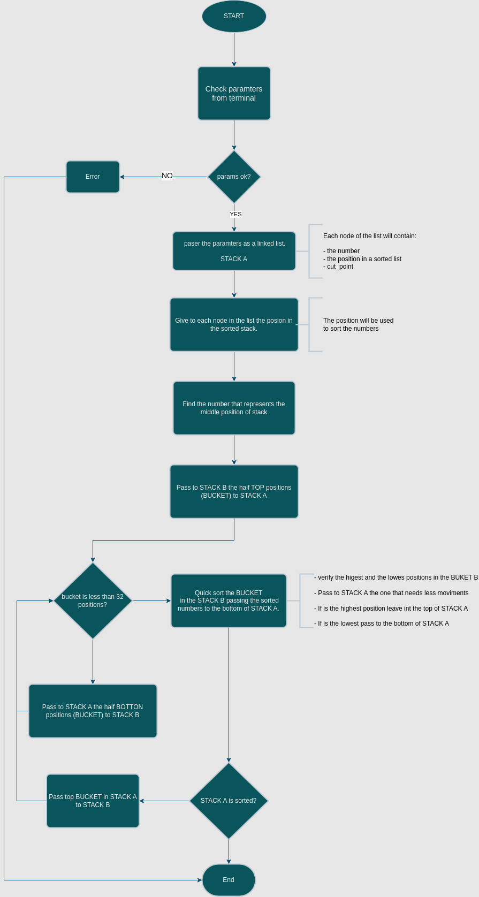

# Push-Swap Project

## Description

The Push_swap project is a very simple and highly effective algorithm project.  
Data will need to be sorted. You have at your disposal a set of int values, 2 stacks and a set of
instructions to manipulate both stacks.  
Your goal is to write a program in C called push_swap which calculates and displays on the standard output the smallest program using Push_swap instructions that sorts the integer arguments received.  

Instructions:  

> <ul>
> <li>sa - swap the first two numbers on stack A</li>
> <li>sb - swap the first two numbers on stack B</li>
> <li>ss - runs sa and sb instructions at the same time</li>
> <li>ra - take the the number on the top of stack A and shift to the last position</li>
> <li>rb - take the the number on the top of stack B and shift to the last position</li>
> <li>rr - runs ra and rb instructions at the same time</li>
> <li>rra - take the the number on the botton of stack A and shift to the top position</li>
> <li>rrb - take the the number on the botton of stack B and shift to the top position</li>
> <li>rr - runs rra and rrb instructions at the same time</li>
> <li>pa - push the number on the top of stack B to the top of stack A</li>
> <li>pb - push the number on the top of stack A to the top of stack B</li>
> <li>pp - runs pa and pb instructions at the same time</li>
> </ul>

## The Algorithm

## How to Use

> Clone the repository: `https://github.com/FaustoFaggion/42_school_Push-Swap.git`

> Enter into the repository `cd push_swap` and compile the program using `make`.  

> How to pass the numbers to be sorted:  
> * as single arguments ./push_swap 1 3 7 4 2  
> * as a string ./push_swap "1 3 7 4 2"  
> * as an environment variable ARG="1 3 7 4 2"; ./push_swap $ARG  

## Tools

[push swap visualizer](https://github.com/o-reo/push_swap_visualizer) by [o-reo](https://github.com/o-reo)